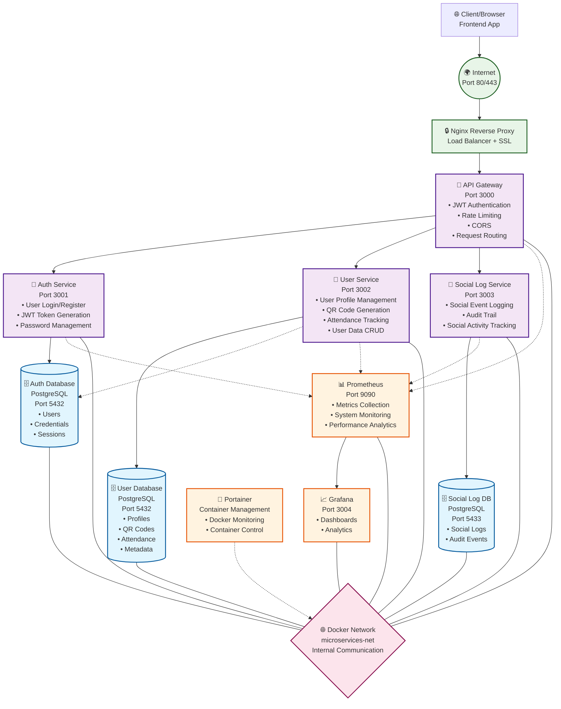

Go Cloud Backend Application Schema




🔧 Detailed Architecture:

🌐 Frontend Layer
Client: Browser/Mobile App interacting with the API

🔒 Proxy Layer
Nginx: Reverse proxy, SSL termination, load balancing
Ports: 80 (HTTP) → 443 (HTTPS)

🚪 API Gateway Layer
Gateway Service: Single entry point
Features: JWT auth, rate limiting, CORS, routing
Port: 3000

🎯 Microservices Layer
Auth Service (Port 3001):
- User registration/login
- JWT token management
- Password security

User Service (Port 3002):
- User profile management
- QR code generation
- Attendance tracking
- CRUD operations

Social Log Service (Port 3003):
- Social event logging
- Audit trail
- Social activity monitoring

🗄️ Database Layer
Auth DB: User credentials, sessions
User DB: Profiles, QR codes, attendance data
Social Log DB: Logs and audit events
Cross-connection: User Service can read Auth DB for sync

📊 Monitoring Layer
Prometheus: Metrics and monitoring
Grafana: Dashboards and analytics (port 3004)
Portainer: Container management via web UI

🌐 Network Layer
Docker Network: Secure internal communication between services
Service Discovery: Automatic DNS resolution between containers

🚀 Request Flow:
Client → Internet → Nginx → Gateway
Gateway verifies JWT and routes the request
Gateway → Auth/User/Social Log Service (based on route)
Services → Database for data persistence
Response returns through the same path
Prometheus monitors the entire flow
System is scalable, secure, and monitored! 🎉

Go Cloud Backend Visual Schema

```
                               🌍 INTERNET
                                    |
                           ┌────────▼────────┐
                           │   🔒 NGINX      │
                           │ Reverse Proxy   │
                           │   Port 80/443   │
                           └────────┬────────┘
                                    |
                           ┌────────▼────────┐
                           │   🚪 GATEWAY    │
                           │  API Gateway    │
                           │   Port 3000     │
                           │ • JWT Auth      │
                           │ • Rate Limit    │
                           │ • CORS          │
                           └────────┬────────┘
                                    |
               ┌────────────┬────────────┬────────────┐
               │            │            │            │
      ┌────────▼────────┐   │   ┌────────▼────────┐   │   ┌────────▼────────┐
      │  🔐 AUTH        │   │   │  👥 USER        │   │   │  📜 SOCIAL LOG  │
      │   SERVICE       │   │   │   SERVICE       │   │   │   SERVICE       │
      │  Port 3001      │   │   │  Port 3002      │   │   │  Port 3003      │
      │ • Login/Register│   │   │ • Profile Mgmt  │   │   │ • Social Events │
      │ • JWT Tokens    │   │   │ • QR Codes      │   │   │ • Audit Trail   │
      │ • Passwords     │   │   │ • Attendance    │   │   │ • Activity Log  │
      └────────┬────────┘   │   └────────┬────────┘   │   └────────┬────────┘
               │            │            │            │            │
               │            │            │            │            │
      ┌────────▼────────┐   │   ┌────────▼────────┐   │   ┌────────▼────────┐
      │  🗄️ AUTH DB     │   │   │  🗄️ USER DB     │   │   │  🗄️ SOCIAL LOG DB│
      │   PostgreSQL    │   │   │   PostgreSQL    │   │   │   PostgreSQL    │
      │   Port 5432     │   │   │   Port 5432     │   │   │   Port 5433     │
      │ • Users         │   │   │ • Profiles      │   │   │ • Social Logs   │
      │ • Credentials   │◄──┘   │ • QR Data       │   │   │ • Audit Events  │
      │ • Sessions      │       │ • Attendance    │   │   │                │
      └─────────────────┘       └─────────────────┘       └─────────────────┘
                       
                       🌐 DOCKER NETWORK
                     ┌─────────────────────┐
                     │  microservices-net  │
                     │  Internal Comms     │
                     └─────────────────────┘

                    📊 MONITORING LAYER
             ┌─────────────────┬─────────────────┬─────────────────┐
             │                 │                 │                 │
    ┌────────▼────────┐       │       ┌────────▼────────┐       │   ┌────────▼────────┐
    │ 📊 PROMETHEUS   │       │       │ 🐳 PORTAINER    │       │   │ 📈 GRAFANA      │
    │   Monitoring    │       │       │   Container     │       │   │   Dashboards    │
    │   Port 9090     │       │       │   Management    │       │   │   Port 3004     │
    │ • Metrics       │       │       │ • Docker UI     │       │   │ • Analytics     │
    │ • Analytics     │       │       │ • Logs View     │       │   │ • Monitoring    │
    └─────────────────┘       │       └─────────────────┘       │   └─────────────────┘
                              │
                   ┌──────────▼──────────┐
                   │    ☁️ GOOGLE        │
                   │   CLOUD COMPUTE     │
                   │      ENGINE         │
                   │  VM: 34.140.122.146 │
                   │   Ubuntu 22.04      │
                   └─────────────────────┘
```


🔄 Request Flow:
👤 Client
   │
   │ HTTPS Request
   ▼
🔒 Nginx (80/443)
   │
   │ Proxy Pass
   ▼
🚪 Gateway (3000)
   │
   ├─ JWT Validation
   ├─ Rate Limiting  
   ├─ CORS Check
   │
   │ Route Decision
   ▼
┌─────────────┬─────────────┬─────────────┐
│             │             │             │
▼             ▼             ▼             ▼
🔐 Auth      👥 User       📜 Social Log
Service      Service      Service
(3001)       (3002)       (3003)
│             │             │
▼             ▼             ▼
🗄️ Auth DB   🗄️ User DB   🗄️ Social Log DB
(5432)       (5432)       (5433)


🎯 Ports and Services:

┌─────────────────────────────────────────┐
│              PORT MAPPING               │
├─────────────────────────────────────────┤
│ 🌐 External (Internet) Access:         │
│   • 80    → Nginx (HTTP)               │
│   • 443   → Nginx (HTTPS)              │
│   • 9090  → Prometheus (if open)       │
│   • 3004  → Grafana (Monitoring UI)    │
├─────────────────────────────────────────┤
│ 🔒 Internal (Docker Network) Only:     │
│   • 3000  → Gateway                    │
│   • 3001  → Auth Service               │
│   • 3002  → User Service               │
│   • 3003  → Social Log Service         │
│   • 5432  → PostgreSQL (Auth)          │
│   • 5432  → PostgreSQL (User)          │
│   • 5433  → PostgreSQL (Social Log)    │
└─────────────────────────────────────────┘

🏗️ Technology Stack:
┌─────────────────────────────────────────┐
│              TECH STACK                 │
├─────────────────────────────────────────┤
│ 🔧 Backend: Go (Fiber Framework)       │
│ 🗄️ Database: PostgreSQL 15             │
│ 🐳 Container: Docker + Docker Compose  │
│ 🔒 Proxy: Nginx                        │
│ 📊 Monitoring: Prometheus, Grafana      │
│ 🎛️ Management: Portainer               │
│ ☁️ Cloud: Google Cloud Platform        │
│ 🔐 Auth: JWT Tokens                    │
│ 🌐 API: RESTful + JSON                 │
└─────────────────────────────────────────┘

Fully containerized, scalable, and monitored system! 🚀

go-cloud-backend/
├── .dockerignore
├── .env
├── .gitignore
├── docker-compose.prod.yml
├── fix_metrics.sh
├── Makefile
├── readme.md
├── .github/
│   └── workflows/
│       smart-deploy.yml
├── auth-service/
│   ├── Dockerfile
│   ├── go.mod
│   ├── go.sum
│   ├── main.go
│   ├── database/
│   │   connection.go
│   ├── migrations/
│   │   0001_create_users.sql
│   │   0002_add_role_to_users.sql
│   │   0003_add_names_to_users.sql
│   │   0004_add_last_login_to_users.sql
│   │   0005_create_auth_log.sql
│   └── models/
│       auth_log.go
├── frontend/
│   └── index.html
├── gateway/
│   ├── Dockerfile
│   ├── go.mod
│   ├── go.sum
│   └── main.go
├── monitoring/
│   ├── dashboard-api/
│   │   ├── Dockerfile
│   │   ├── go.mod
│   │   ├── go.sum
│   │   ├── main.go
│   │   └── docs/
│   │       docs.go
│   │       swagger.json
│   │       swagger.yaml
│   ├── grafana/
│   │   └── provisioning/
│   │       ├── dashboards/
│   │       │   default.json
│   │       └── datasources/
│   │           prometheus.yml
│   └── prometheus-service/
│       ├── Dockerfile
│       ├── go.mod
│       ├── go.sum
│       ├── main.go
│       ├── prometheus-service.exe
│       ├── README.md
│       ├── config/
│       │   prometheus.yml
│       ├── metrics/
│       │   collectors.go
│       └── middleware/
│           metrics.go
├── nginx/
│   nginx.conf
├── pg-backup/
│   .pgpass
│   backup.sh
│   crontab.txt
│   Dockerfile
├── shared/
│   go.mod
│   go.sum
│   └── metrics/
│       middleware.go
├── social-log-service/
│   db.go
│   Dockerfile
│   go.mod
│   go.sum
│   handler.go
│   main.go
│   model.go
│   README.md
│   schema.sql
│   social-log-service
│   social-log-service.exe
├── systemd/
│   go-microservices-auth.service
│   go-microservices-gateway.service
│   go-microservices-user.service
└── user-service/
    ├── Dockerfile
    ├── go.mod
    ├── go.sum
    ├── main
    ├── main.go
    ├── qr_handlers.go
    ├── user-service-test
    ├── database/
    │   connection.go
    ├── handlers/
    │   qr_handlers.go
    ├── migrations/
    │   0001_create_users.sql
    │   0003_create_attendance_events.sql
    │   0004_create_attendance.sql
    │   0005_add_role_to_users.sql
    │   0006_add_auth_fields_to_users.sql
    │   0007_add_role_column.sql
    │   0008_event_user_status_management.sql
    │   0009_create_attendance_triggers.sql
    │   0010_ensure_name_surname_columns.sql
    │   0011_fix_status_trigger.sql
    │   0012_automatic_qr_system_final.sql
    │   0013_add_timestamp_to_attendance_events.sql
    ├── models/
    │   qr_models.go
    ├── services/
    │   qr_service.go
    └── utils/
        jwt_utils.go

## Automatic Database Backup

- There is a custom `pg-backup` container that performs a backup of all main databases (auth, user, social-log) every day (at 2:00 AM).
- Backups are saved in the `./backups` folder.
- For each database, **only the last 5 backups** are kept: every time a new backup is created, the oldest one is automatically deleted.
- The backup and retention logic is managed by the script `pg-backup/backup.sh` and the container's crontab.
- All credentials are securely managed via the `.pgpass` file.

Example backup structure:
```
backups/
  auth_logs_db_2025-06-23_02-00-00.sql.gz
  users_db_2025-06-23_02-00-00.sql.gz
  social_logs_db_2025-06-23_02-00-00.sql.gz
  ... (max 5 per type)
```